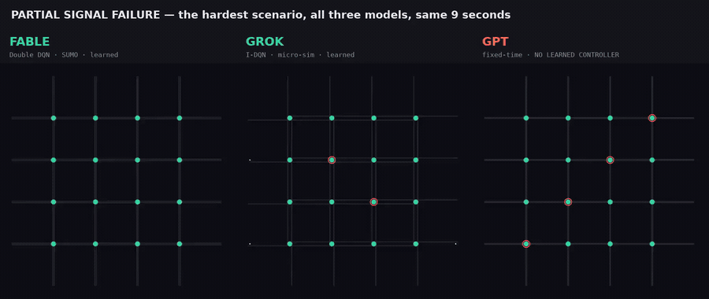

# Three Agents, One Brief

Three AI models — **Fable**, **Grok** and **GPT** — were each handed the same task:

> Train a reinforcement-learning controller for a 4×4 grid of 16 traffic signals, evaluate it
> across eight stress scenarios, and prove it holds up.

Same brief, same 3-vCPU CPU-only box, no human help. This repository holds all three attempts,
their artifacts, and an honest comparison of what came out.

**Two of them finished. One never wrote the agent.**



*Partial signal failure — the hardest scenario — running in all three at once. Red rings are dead
signals. Fable and Grok mix teal and amber: every intersection is picking its own phase. GPT's are
locked in unison, because they are on a fixed timer that senses nothing. The red roads behind them
are the queues that follow.*

---

## The short version

| | **Fable** | **Grok** | **GPT** |
|---|---|---|---|
| Status | ✅ Complete | ✅ Complete | ❌ **Agent never written** |
| Algorithm | Parameter-shared Double DQN | Shared multi-agent I-DQN | — |
| Simulator | Eclipse SUMO 1.27 (`libsumo`) | Own pure-Python micro-sim | SUMO (smoke test only) |
| Signal phases | 4 | 2 | 2 (static) |
| Model size | 19,844 params | 5,890 params | no model |
| Training | 3,063 episodes · 1.70 h | 339 episodes · 0.23 h | never started |
| Episodes evaluated | **160 / 160**, 0 failed | **160 / 160**, 0 failed | **0** |
| Final deliverable | ✅ full pipeline + report | ✅ full pipeline + report | ❌ 219 lines of scaffolding |

GPT built a working network generator and a working SUMO environment wrapper, then stopped. It has
no Q-network, no training loop, no checkpoint, and no results. Its README documents a pipeline that
does not exist on disk. **It contributes no performance data and appears in no chart.**

📄 **[Read the full comparison report →](REPORT.md)**

---

## ⚠️ Read this before comparing any number

**Fable and Grok did not run on the same simulator, so their raw metrics are not on a common axis.**

Fable ran real SUMO with proper car-following physics, 1800-second episodes and 4 signal phases.
Grok's CityFlow install failed on the host, so it wrote *its own* pure-Python micro-simulator and
ran 360-step episodes with 2 phases.

That makes the obvious comparison a trap:

> Grok's mean waiting time is **7.68 s**. Fable's is **47.68 s**.
> This is **not** a 6× win. Grok's episodes are five times shorter and its car-following is far
> looser, so queues have less time — and less physics — in which to form. Throughput is worse
> still: Fable reports **veh/h**, Grok reports **veh/step**. Different quantities entirely.

Exactly two things survive the difference in simulators, and they are the only things the report
compares head-to-head:

1. **Degradation against each run's own baseline** — the simulator cancels out of a ratio.
2. **Resource cost** — latency and memory, measured on the same machine.

---

## The one fair performance comparison

Each scenario's mean waiting time ÷ *that same run's* normal-traffic waiting time.

| Scenario | Fable | Grok |
|---|---:|---:|
| Partial signal failure | **4.84×** | **4.48×** |
| Missing sensors | **4.25×** | **3.13×** |
| Noisy sensors | 3.39× | 1.27× |
| Sudden surge | 1.60× | 1.17× |
| High demand | 1.53× | 1.25× |
| Road closure | 1.23× | 0.99× |
| Uneven directional | 0.95× | 1.06× |
| *(normal baseline)* | *20.30 s* | *4.29 s* |

**The two runs independently agree on what is hard.** Partial signal failure is worst for both,
missing sensors second, and road closure and uneven demand are close to free for both. Two different
algorithms on two different simulators converging on the same ranking is a stronger result than
either run's absolute numbers.

---

## The rollouts

Each clip replays a **frozen checkpoint** — greedy, no training, no fine-tuning — on the exact seeds
from that run's evaluation, walking through all eight scenarios back to back.

| | Video | What it is |
|---|---|---|
| **Fable** | [`fable_rollout.mp4`](showcase/out/web/fable_rollout.mp4) | Trained Double DQN policy |
| **Grok** | [`grok_rollout.mp4`](showcase/out/web/grok_rollout.mp4) | Trained I-DQN policy |
| **GPT** | [`gpt_rollout.mp4`](showcase/out/web/gpt_rollout.mp4) | ⚠️ **Not a trained policy** — GPT's network under SUMO's default fixed-time program |
| **All three** | [`stress_3up.mp4`](showcase/out/web/stress_3up.mp4) | Synchronized partial-signal-failure comparison |

**How to read a frame:** road colour is live queue · a red vehicle dot is stopped · a teal
intersection has north–south green, amber has east–west · a red ring is a failed signal.

The GPT clip exists because GPT has no model to record. It shows GPT's own network — which its
`network.py` really does build correctly — running under ordinary fixed-time signals that sense
nothing and learn nothing. Every frame is labelled `NO LEARNED CONTROLLER`. **It is an un-learned
reference point, never GPT's result.**

---

## Layout

```
├── REPORT.md              ← the full comparison, all numbers, all caveats
├── Fable/                 ← complete run: Double DQN on SUMO
│   ├── REPORT.md            its own technical report
│   ├── src/ train.py evaluate.py visualize.py
│   ├── checkpoints/         model_best.pt (the policy in the video)
│   └── results/             aggregate.json · metrics.csv · benchmark.json
├── Grok/                  ← complete run: I-DQN on a hand-written micro-sim
│   ├── REPORT.md            its own technical report
│   ├── src/                 agent/ env/ sim/ metrics/ viz/
│   ├── checkpoints/         idqn_shared.pt (the policy in the video)
│   └── artifacts/           metrics_aggregate.json · metrics_per_seed.csv
├── GPT/                   ← incomplete: scaffolding only, no agent
│   ├── src/                 network.py · simulator.py  (both work)
│   └── artifacts/smoke/     verification.json — 1 signal, 1 vehicle, 26 steps
└── showcase/              ← the videos and the code that made them
    ├── record_*.py          replay each frozen checkpoint, capture state
    ├── render_video.py      turn a trace into video
    ├── traces/              recorded rollout state (.npz)
    └── out/web/             the committed 720p videos
```

Each run is self-contained with its **own `venv/` and `requirements.txt`** — they pin different
versions and are not interchangeable. The venvs are gitignored; recreate them per-run.

## Reproducing

```bash
# Per-run: create the venv and install that run's pinned deps
cd Fable && python3 -m venv venv && venv/bin/pip install -r requirements.txt

# Fable — train, evaluate, visualize
venv/bin/python train.py
venv/bin/python evaluate.py
venv/bin/python visualize.py

# Grok — same idea, driven by scripts/
cd ../Grok && venv/bin/python scripts/train.py
venv/bin/python scripts/evaluate.py
```

Rebuilding the videos (needs both venvs, since each replays its own checkpoint):

```bash
Fable/venv/bin/python showcase/record_fable.py     # replay frozen checkpoint -> traces/
Grok/venv/bin/python  showcase/record_grok.py
Fable/venv/bin/python showcase/render_video.py --model fable
Grok/venv/bin/python  showcase/render_video.py --model grok
```

The full-resolution 1080p masters (~87 MB across four container formats) are **gitignored** — the
commands above regenerate them. Only the 720p web versions are committed.

The replay is deterministic: Grok's normal-traffic replay completes 311 trips, matching the 311
recorded in its own `metrics_per_seed.csv`.

---

## A note on what this repo is

This is a comparison of *what three models produced*, not a traffic-engineering result. Neither
completed run evaluated a fixed-time or actuated baseline, so **neither can claim to beat
conventional signals** — only to beat its own degraded self. The caveats are not footnotes here;
they are in [REPORT.md](REPORT.md) §6, and they are the most important part of it.
